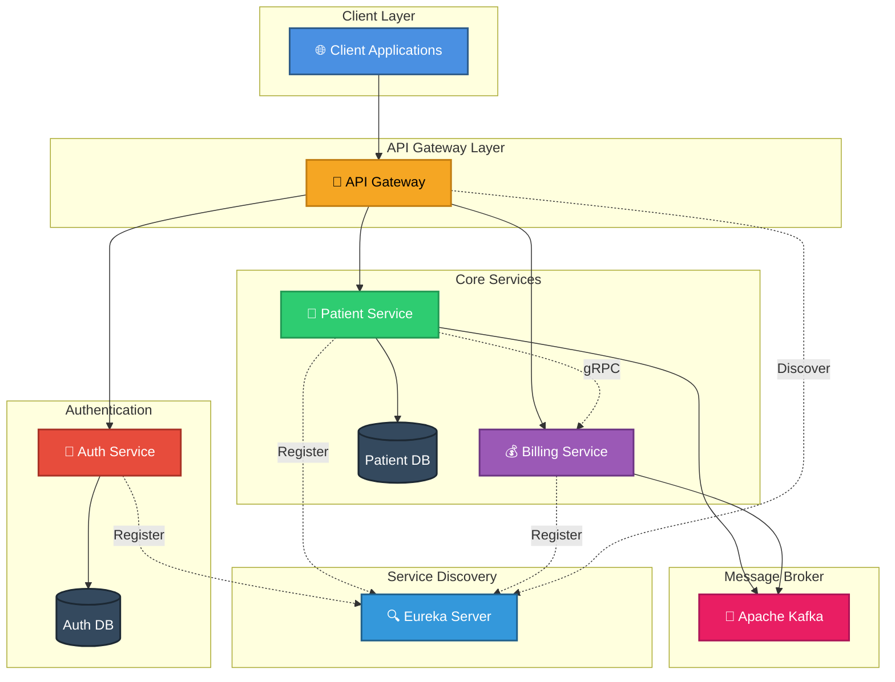
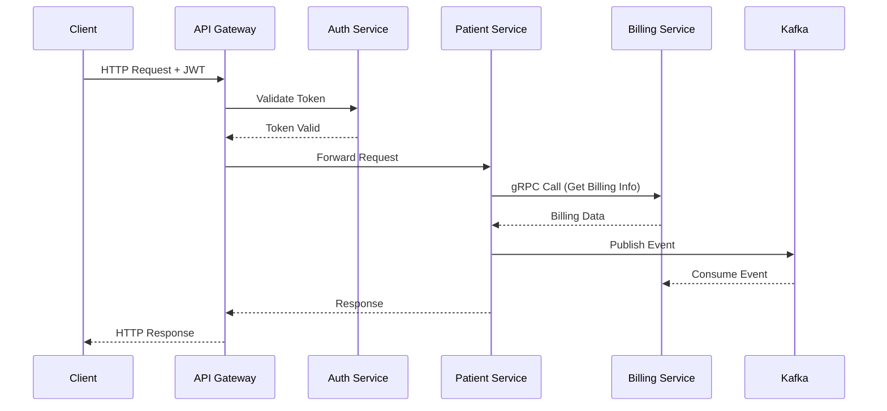
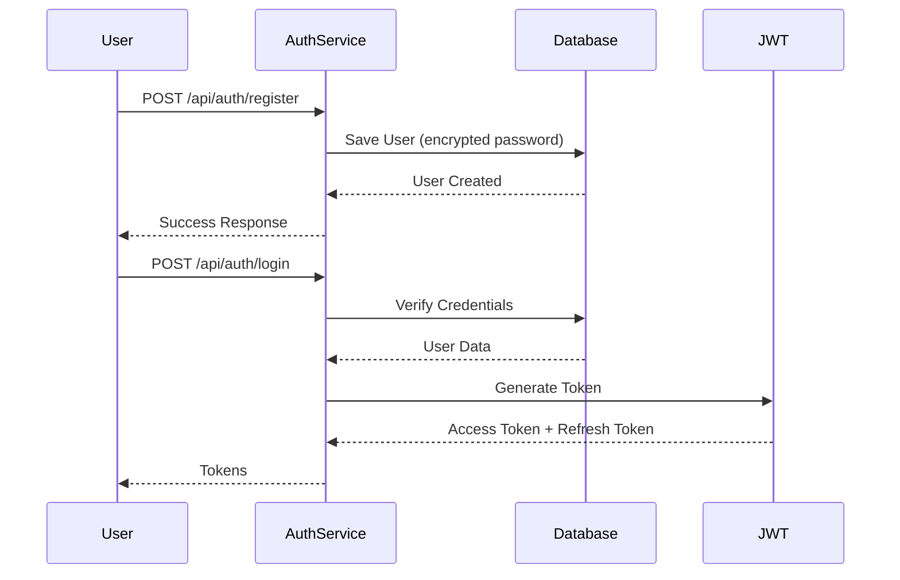

# 🚀 Java Spring Microservices Architecture

<div align="center">


**A production-ready microservices architecture built with Spring Boot, demonstrating modern cloud-native patterns and best practices**

</div>

---

## 📋 Table of Contents

- [Overview](#-overview)
- [Architecture](#-architecture)
- [Key Features](#-key-features)
- [Tech Stack](#-tech-stack)
- [Services](#-services)
- [Prerequisites](#-prerequisites)
- [Quick Start](#-quick-start)
- [Configuration](#-configuration)
- [API Documentation](#-api-documentation)
- [Development](#-development)
- [Testing](#-testing)
- [Deployment](#-deployment)
- [Monitoring](#-monitoring)
- [Contributing](#-contributing)
- [License](#-license)

---

## 🎯 Overview

This project showcases a comprehensive microservices architecture using Spring Boot and Spring Cloud ecosystem. It demonstrates key patterns including service discovery, API gateway, inter-service communication via gRPC and Kafka, distributed authentication, and containerization.

### 🎥 Tutorial Series

This codebase is part of a comprehensive YouTube tutorial series on building production-ready microservices. Join our [Discord community](https://discord.com) for help, discussions, and updates!

---

## 🏗 Architecture



### Communication Patterns



---

## ✨ Key Features

### 🔐 Security & Authentication
- **JWT-based authentication** with Spring Security
- **Role-based access control** (RBAC)
- **Secure inter-service communication** via gRPC
- **Password encryption** using BCrypt

### 🔄 Communication
- **Synchronous**: REST APIs and gRPC
- **Asynchronous**: Apache Kafka event streaming
- **Protocol Buffers** for efficient data serialization

### 🗄️ Data Management
- **PostgreSQL** for persistent storage
- **H2** for testing environments
- **JPA/Hibernate** for ORM
- **Database migrations** with SQL initialization

### 🐳 DevOps & Deployment
- **Docker Compose** for local development
- **Multi-container orchestration**
- **Remote debugging** support
- **Environment-based configuration**

### 📊 API & Documentation
- **OpenAPI/Swagger** documentation
- **RESTful API design** principles
- **Versioned APIs**

---

## 🛠 Tech Stack

### Backend Framework
| Technology | Version | Purpose |
|------------|---------|---------|
|  | 3.x | Core framework |
|  | Latest | Microservices toolkit |
|  | 17+ | Programming language |

### Communication
| Technology | Version | Purpose |
|------------|---------|---------|
|  | 1.69 | RPC framework |
|  | 3.x | Event streaming |
|  | 4.29 | Data serialization |

### Data & Storage
| Technology | Version | Purpose |
|------------|---------|---------|
|  | 15+ | Primary database |
|  | Latest | Test database |
|  | Latest | ORM framework |

### Security
| Technology | Version | Purpose |
|------------|---------|---------|
|  | 6.x | Security framework |
|  | 0.12.6 | Token-based auth |

### DevOps & Tools
| Technology | Version | Purpose |
|------------|---------|---------|
|  | Latest | Containerization |
|  | 3.x | Build tool |
|  | 2.6.0 | API documentation |

---

## 🎯 Services

### 🔐 Auth Service
**Port:** `8080`

Handles user authentication and authorization.

**Features:**
- JWT token generation and validation
- User registration and login
- Role-based access control
- Secure password storage

**Endpoints:**
```
POST   /api/auth/register  - Register new user
POST   /api/auth/login     - User login
GET    /api/auth/validate  - Validate JWT token
POST   /api/auth/refresh   - Refresh access token
```

**Default User:**
```
Email: testuser@test.com
Password: test123
Role: ADMIN
```

---

### 👥 Patient Service
**Port:** `8081`

Manages patient records and medical information.

**Features:**
- CRUD operations for patients
- Integration with Billing Service via gRPC
- Event publishing to Kafka
- PostgreSQL persistence

**Endpoints:**
```
GET    /api/patients       - Get all patients
GET    /api/patients/{id}  - Get patient by ID
POST   /api/patients       - Create new patient
PUT    /api/patients/{id}  - Update patient
DELETE /api/patients/{id}  - Delete patient
```

---

### 💰 Billing Service
**Port:** `8082` (HTTP) | `9005` (gRPC)

Handles billing operations and payment processing.

**Features:**
- gRPC server for inter-service calls
- Kafka event consumption
- Billing calculations and invoicing

**gRPC Methods:**
```protobuf
service BillingService {
  rpc GetBilling(BillingRequest) returns (BillingResponse);
  rpc CreateInvoice(InvoiceRequest) returns (InvoiceResponse);
}
```

---

## 📦 Prerequisites

Before you begin, ensure you have the following installed:

- ☕ **Java JDK 17+** - [Download](https://adoptium.net/)
- 🔨 **Maven 3.8+** - [Download](https://maven.apache.org/download.cgi)
- 🐳 **Docker & Docker Compose** - [Download](https://www.docker.com/products/docker-desktop)
- 💻 **IDE** - IntelliJ IDEA (recommended) or Eclipse
- 📝 **Git** - [Download](https://git-scm.com/downloads)

**Verify Installation:**
```bash
java -version    # Should show Java 17+
mvn -version     # Should show Maven 3.8+
docker --version # Should show Docker 20+
```

---

## 🚀 Quick Start

### 1️⃣ Clone the Repository

```bash
git clone https://github.com/chrisblakely01/java-spring-microservices.git
cd java-spring-microservices
```

### 2️⃣ Build All Services

```bash
# Build all microservices
mvn clean install -DskipTests

# Or build individual services
cd auth-service && mvn clean install
cd ../patient-service && mvn clean install
cd ../billing-service && mvn clean install
```

### 3️⃣ Start Infrastructure with Docker Compose

```bash
# Start PostgreSQL, Kafka, and all services
docker-compose up -d

# View logs
docker-compose logs -f

# Check running containers
docker ps
```

### 4️⃣ Verify Services

```bash
# Check Auth Service
curl http://localhost:8080/actuator/health

# Check Patient Service
curl http://localhost:8081/actuator/health

# Check Billing Service
curl http://localhost:8082/actuator/health
```

### 5️⃣ Access API Documentation

Open your browser and navigate to:

- **Auth Service:** http://localhost:8080/swagger-ui.html
- **Patient Service:** http://localhost:8081/swagger-ui.html
- **Billing Service:** http://localhost:8082/swagger-ui.html

---

## ⚙️ Configuration

### Environment Variables

#### Auth Service

```bash
SPRING_DATASOURCE_URL=jdbc:postgresql://auth-service-db:5432/db
SPRING_DATASOURCE_USERNAME=admin_user
SPRING_DATASOURCE_PASSWORD=password
SPRING_JPA_HIBERNATE_DDL_AUTO=update
SPRING_SQL_INIT_MODE=always
```

#### Patient Service

```bash
SPRING_DATASOURCE_URL=jdbc:postgresql://patient-service-db:5432/db
SPRING_DATASOURCE_USERNAME=admin_user
SPRING_DATASOURCE_PASSWORD=password
SPRING_JPA_HIBERNATE_DDL_AUTO=update
SPRING_KAFKA_BOOTSTRAP_SERVERS=kafka:9092
SPRING_SQL_INIT_MODE=always
BILLING_SERVICE_ADDRESS=billing-service
BILLING_SERVICE_GRPC_PORT=9005
```

#### Kafka Configuration

```bash
KAFKA_CFG_ADVERTISED_LISTENERS=PLAINTEXT://kafka:9092,EXTERNAL://localhost:9094
KAFKA_CFG_CONTROLLER_LISTENER_NAMES=CONTROLLER
KAFKA_CFG_CONTROLLER_QUORUM_VOTERS=0@kafka:9093
KAFKA_CFG_LISTENER_SECURITY_PROTOCOL_MAP=CONTROLLER:PLAINTEXT,EXTERNAL:PLAINTEXT,PLAINTEXT:PLAINTEXT
KAFKA_CFG_LISTENERS=PLAINTEXT://:9092,CONTROLLER://:9093,EXTERNAL://:9094
KAFKA_CFG_NODE_ID=0
KAFKA_CFG_PROCESS_ROLES=controller,broker
```

### Application Properties

#### Kafka Consumer (Patient/Billing Service)

```properties
spring.kafka.consumer.key-deserializer=org.apache.kafka.common.serialization.StringDeserializer
spring.kafka.consumer.value-deserializer=org.apache.kafka.common.serialization.ByteArrayDeserializer
spring.kafka.bootstrap-servers=kafka:9092
```

---

## 📚 API Documentation

### Authentication Flow



### Example API Calls

#### Register User

```bash
curl -X POST http://localhost:8080/api/auth/register \
  -H "Content-Type: application/json" \
  -d '{
    "email": "user@example.com",
    "password": "SecurePass123!",
    "role": "USER"
  }'
```

#### Login

```bash
curl -X POST http://localhost:8080/api/auth/login \
  -H "Content-Type: application/json" \
  -d '{
    "email": "testuser@test.com",
    "password": "test123"
  }'
```

#### Create Patient (Authenticated)

```bash
curl -X POST http://localhost:8081/api/patients \
  -H "Content-Type: application/json" \
  -H "Authorization: Bearer YOUR_JWT_TOKEN" \
  -d '{
    "firstName": "John",
    "lastName": "Doe",
    "dateOfBirth": "1990-01-01",
    "email": "john.doe@example.com"
  }'
```

---

## 👨‍💻 Development

### Project Structure

```
java-spring-microservices/
├── auth-service/
│   ├── src/
│   │   ├── main/
│   │   │   ├── java/
│   │   │   │   └── com/healthcare/auth/
│   │   │   │       ├── config/
│   │   │   │       ├── controller/
│   │   │   │       ├── entity/
│   │   │   │       ├── repository/
│   │   │   │       ├── service/
│   │   │   │       └── security/
│   │   │   └── resources/
│   │   │       ├── application.properties
│   │   │       └── data.sql
│   │   └── test/
│   └── pom.xml
├── patient-service/
│   ├── src/
│   │   ├── main/
│   │   │   ├── java/
│   │   │   ├── proto/
│   │   │   └── resources/
│   │   └── test/
│   └── pom.xml
├── billing-service/
│   ├── src/
│   │   ├── main/
│   │   │   ├── java/
│   │   │   ├── proto/
│   │   │   └── resources/
│   │   └── test/
│   └── pom.xml
├── docker-compose.yml
└── README.md
```

### Adding gRPC Dependencies

Add to `pom.xml`:

```xml
<dependencies>
    <!-- gRPC -->
    <dependency>
        <groupId>io.grpc</groupId>
        <artifactId>grpc-netty-shaded</artifactId>
        <version>1.69.0</version>
    </dependency>
    <dependency>
        <groupId>io.grpc</groupId>
        <artifactId>grpc-protobuf</artifactId>
        <version>1.69.0</version>
    </dependency>
    <dependency>
        <groupId>io.grpc</groupId>
        <artifactId>grpc-stub</artifactId>
        <version>1.69.0</version>
    </dependency>
    <dependency>
        <groupId>net.devh</groupId>
        <artifactId>grpc-spring-boot-starter</artifactId>
        <version>3.1.0.RELEASE</version>
    </dependency>
    <dependency>
        <groupId>com.google.protobuf</groupId>
        <artifactId>protobuf-java</artifactId>
        <version>4.29.1</version>
    </dependency>
    <dependency>
        <groupId>org.apache.tomcat</groupId>
        <artifactId>annotations-api</artifactId>
        <version>6.0.53</version>
        <scope>provided</scope>
    </dependency>
</dependencies>
```

### Build Configuration for Protobuf

```xml
<build>
    <extensions>
        <extension>
            <groupId>kr.motd.maven</groupId>
            <artifactId>os-maven-plugin</artifactId>
            <version>1.7.0</version>
        </extension>
    </extensions>
    <plugins>
        <plugin>
            <groupId>org.springframework.boot</groupId>
            <artifactId>spring-boot-maven-plugin</artifactId>
        </plugin>
        <plugin>
            <groupId>org.xolstice.maven.plugins</groupId>
            <artifactId>protobuf-maven-plugin</artifactId>
            <version>0.6.1</version>
            <configuration>
                <protocArtifact>com.google.protobuf:protoc:3.25.5:exe:${os.detected.classifier}</protocArtifact>
                <pluginId>grpc-java</pluginId>
                <pluginArtifact>io.grpc:protoc-gen-grpc-java:1.68.1:exe:${os.detected.classifier}</pluginArtifact>
            </configuration>
            <executions>
                <execution>
                    <goals>
                        <goal>compile</goal>
                        <goal>compile-custom</goal>
                    </goals>
                </execution>
            </executions>
        </plugin>
    </plugins>
</build>
```

### Remote Debugging

Enable remote debugging by adding to your run configuration:

```bash
JAVA_TOOL_OPTIONS=-agentlib:jdwp=transport=dt_socket,server=y,suspend=n,address=*:5005
```

Then connect your IDE debugger to `localhost:5005`

---

## 🧪 Testing

### Run Unit Tests

```bash
# All services
mvn test

# Specific service
cd auth-service && mvn test
```

### Run Integration Tests

```bash
mvn verify
```

### Test Coverage

```bash
mvn jacoco:report
```

View coverage report at: `target/site/jacoco/index.html`

---

## 🚢 Deployment

### Docker Compose Deployment

```bash
# Production build
docker-compose -f docker-compose.prod.yml up -d

# Scale services
docker-compose up -d --scale patient-service=3
```

### Kubernetes Deployment

```bash
# Apply configurations
kubectl apply -f k8s/

# Check deployments
kubectl get pods
kubectl get services

# View logs
kubectl logs -f deployment/patient-service
```

---

## 📊 Monitoring

### Health Checks

All services expose Spring Boot Actuator endpoints:

```bash
# Health
curl http://localhost:8080/actuator/health

# Metrics
curl http://localhost:8080/actuator/metrics

# Info
curl http://localhost:8080/actuator/info
```

### Logging

Logs are available via Docker:

```bash
# View all logs
docker-compose logs

# Follow specific service
docker-compose logs -f patient-service

# Last 100 lines
docker-compose logs --tail=100
```


---

## 📝 License

This project is licensed under the MIT License - see the [LICENSE](LICENSE) file for details.

---


## 🗺️ Roadmap

- [ ] Add Eureka Service Discovery
- [ ] Implement API Gateway with Spring Cloud Gateway
- [ ] Add Circuit Breaker with Resilience4j
- [ ] Implement Distributed Tracing with Zipkin
- [ ] Add Centralized Configuration with Spring Cloud Config
- [ ] Implement Rate Limiting
- [ ] Add GraphQL API
- [ ] Kubernetes Deployment Manifests
- [ ] Add Monitoring with Prometheus & Grafana
- [ ] Implement ELK Stack for logging

---

<div align="center">


[⬆ Back to Top](#-java-spring-microservices-architecture)

</div>
