# 👥 Patient Service

<div align="center">


**RESTful microservice for managing patient records with event-driven architecture and inter-service communication**

[🏠 Main Repository](https://github.com/chrisblakely01/java-spring-microservices) • [📺 YouTube Tutorial](https://youtube.com) • [💬 Discord Community](https://discord.com)

</div>

---

## 📋 Table of Contents

- [Overview](#-overview)
- [Architecture](#-architecture)
- [Features](#-features)
- [Tech Stack](#-tech-stack)
- [Prerequisites](#-prerequisites)
- [Getting Started](#-getting-started)
- [API Documentation](#-api-documentation)
- [Database Schema](#-database-schema)
- [Configuration](#-configuration)
- [gRPC Integration](#-grpc-integration)
- [Kafka Integration](#-kafka-integration)
- [Testing](#-testing)
- [Deployment](#-deployment)
- [Troubleshooting](#-troubleshooting)

---

## 🎯 Overview

The **Patient Service** is a core microservice in the healthcare management system, responsible for managing patient records, medical history, and personal information. It demonstrates modern microservices patterns including RESTful APIs, event-driven architecture with Kafka, and synchronous communication via gRPC.

### Key Responsibilities

- 📝 **Patient Management**: CRUD operations for patient records
- 🔄 **Event Publishing**: Broadcasts patient events to Kafka topics
- 🔗 **Service Integration**: Communicates with Billing Service via gRPC
- 💾 **Data Persistence**: Stores patient data in PostgreSQL database
- 🔐 **Secure Access**: JWT-based authentication integration

---

## 🏗 Architecture

### Service Architecture

```mermaid
graph TB
    subgraph External["External Layer"]
        Client["🌐 Client/API Gateway"]
    end
    
    subgraph ServiceLayer["Patient Service Layer"]
        Controller["🎮 REST Controller"]
        Service["⚙️ Business Service"]
        Repository["💾 JPA Repository"]
        KafkaProducer["📤 Kafka Producer"]
        GrpcClient["🔌 gRPC Client"]
    end
    
    subgraph DataLayer["Data Layer"]
        PostgreSQL[("🗄️ PostgreSQL<br/>Patient DB")]
    end
    
    subgraph ExternalServices["External Services"]
        Kafka["📨 Kafka Broker"]
        BillingService["💰 Billing Service<br/>gRPC Server"]
    end
    
    Client -->|HTTP/REST| Controller
    Controller --> Service
    Service --> Repository
    Service --> KafkaProducer
    Service --> GrpcClient
    Repository --> PostgreSQL
    KafkaProducer -->|Publish Events| Kafka
    GrpcClient -->|gRPC Call| BillingService
    
    style Client fill:#4A90E2,stroke:#2E5C8A,stroke-width:2px,color:#fff
    style Controller fill:#2ECC71,stroke:#229954,stroke-width:2px,color:#fff
    style Service fill:#3498DB,stroke:#21618C,stroke-width:2px,color:#fff
    style Repository fill:#9B59B6,stroke:#6C3483,stroke-width:2px,color:#fff
    style KafkaProducer fill:#E91E63,stroke:#AD1457,stroke-width:2px,color:#fff
    style GrpcClient fill:#F39C12,stroke:#D68910,stroke-width:2px,color:#000
    style PostgreSQL fill:#34495E,stroke:#1C2833,stroke-width:2px,color:#fff
    style Kafka fill:#E74C3C,stroke:#A93226,stroke-width:2px,color:#fff
    style BillingService fill:#16A085,stroke:#117A65,stroke-width:2px,color:#fff
```



### Request Flow


### Data Flow

```mermaid
flowchart LR
    A[📱 Client Request] --> B{🔐 Auth Check}
    B -->|Valid| C[🎮 Controller]
    B -->|Invalid| Z[❌ 401 Unauthorized]
    C --> D[⚙️ Service Layer]
    D --> E{Operation Type}
    E -->|Create/Update| F[💾 Save to DB]
    E -->|Read| G[📖 Query DB]
    E -->|Delete| H[🗑️ Delete from DB]
    F --> I[📤 Publish Event]
    I --> J[📨 Kafka]
    D --> K[🔌 Call Billing Service]
    K --> L[💰 Get Billing Info]
    L --> M[✅ Response]
    G --> M
    H --> M
    F --> M
    M --> N[📦 Return Result]
    
    style A fill:#4A90E2,stroke:#2E5C8A,stroke-width:2px,color:#fff
    style C fill:#2ECC71,stroke:#229954,stroke-width:2px,color:#fff
    style D fill:#3498DB,stroke:#21618C,stroke-width:2px,color:#fff
    style F fill:#9B59B6,stroke:#6C3483,stroke-width:2px,color:#fff
    style I fill:#E91E63,stroke:#AD1457,stroke-width:2px,color:#fff
    style K fill:#F39C12,stroke:#D68910,stroke-width:2px,color:#000
    style M fill:#16A085,stroke:#117A65,stroke-width:2px,color:#fff
    style Z fill:#E74C3C,stroke:#A93226,stroke-width:2px,color:#fff
```



---

## ✨ Features

### 🎯 Core Functionality

- ✅ **Complete CRUD Operations** - Create, Read, Update, Delete patient records
- 🔍 **Advanced Search** - Filter patients by various criteria
- 📄 **Pagination Support** - Efficiently handle large datasets
- ✔️ **Data Validation** - Comprehensive input validation with Bean Validation
- 🔐 **Secure Endpoints** - JWT-based authentication and authorization

### 🔄 Integration Features

- 📨 **Event-Driven Architecture** - Publishes events to Kafka for patient lifecycle
- 🔗 **gRPC Communication** - Synchronous calls to Billing Service
- 🗄️ **Database Persistence** - PostgreSQL with JPA/Hibernate
- 📊 **Health Monitoring** - Spring Boot Actuator endpoints

### 🛠️ Technical Features

- 🎨 **RESTful API Design** - Following REST best practices
- 📝 **OpenAPI/Swagger** - Interactive API documentation
- 🔄 **Transaction Management** - ACID compliance for data operations
- 🐛 **Exception Handling** - Centralized error handling
- 📈 **Metrics & Monitoring** - Production-ready observability

---

## 🛠 Tech Stack

### Core Framework
| Technology | Version | Purpose |
|------------|---------|---------|
|  | 3.x | Application framework |
|  | 17+ | Programming language |
|  | 3.8+ | Build automation |

### Data & Persistence
| Technology | Version | Purpose |
|------------|---------|---------|
|  | 3.x | Data access layer |
|  | 6.x | ORM framework |
|  | 15+ | Primary database |
|  | Latest | In-memory test DB |

### Communication
| Technology | Version | Purpose |
|------------|---------|---------|
|  | 3.3+ | Event streaming |
|  | 1.69 | RPC framework |
|  | 4.29 | Serialization |

### Documentation & Tools
| Technology | Version | Purpose |
|------------|---------|---------|
|  | 2.6.0 | API documentation |
|  | Latest | Boilerplate reduction |
|  | Latest | Containerization |

---

## 📦 Prerequisites

Before running the Patient Service, ensure you have:

- ☕ **Java JDK 17+** - [Download](https://adoptium.net/)
- 🔨 **Maven 3.8+** - [Download](https://maven.apache.org/download.cgi)
- 🐳 **Docker & Docker Compose** - [Download](https://www.docker.com/products/docker-desktop)
- 🗄️ **PostgreSQL 15+** (or use Docker)
- 📨 **Apache Kafka** (or use Docker)

**Verify Installation:**
```bash
java -version
mvn -version
docker --version
```

---

## 🚀 Getting Started

### 1️⃣ Clone the Repository

```bash
git clone https://github.com/chrisblakely01/java-spring-microservices.git
cd java-spring-microservices/patient-service
```

### 2️⃣ Configure Environment Variables

Create a `.env` file or set environment variables:

```bash
# Database Configuration
export SPRING_DATASOURCE_URL=jdbc:postgresql://localhost:5432/patient_db
export SPRING_DATASOURCE_USERNAME=admin_user
export SPRING_DATASOURCE_PASSWORD=password

# Kafka Configuration
export SPRING_KAFKA_BOOTSTRAP_SERVERS=localhost:9092

# Billing Service gRPC
export BILLING_SERVICE_ADDRESS=localhost
export BILLING_SERVICE_GRPC_PORT=9005

# Application Configuration
export SPRING_JPA_HIBERNATE_DDL_AUTO=update
export SPRING_SQL_INIT_MODE=always
```

### 3️⃣ Start Dependencies with Docker

```bash
# Start PostgreSQL and Kafka
docker-compose up -d patient-service-db kafka

# Verify they're running
docker ps
```

### 4️⃣ Build the Application

```bash
# Clean and build
mvn clean install

# Skip tests for faster build
mvn clean install -DskipTests
```

### 5️⃣ Run the Service

**Option A: Using Maven**
```bash
mvn spring-boot:run
```

**Option B: Using Java**
```bash
java -jar target/patient-service-0.0.1-SNAPSHOT.jar
```

**Option C: Using Docker**
```bash
docker-compose up patient-service
```

### 6️⃣ Verify the Service is Running

```bash
# Health check
curl http://localhost:8081/actuator/health

# Expected output:
# {"status":"UP"}
```

### 7️⃣ Access Swagger UI

Open your browser: **http://localhost:8081/swagger-ui.html**

---

## 📚 API Documentation

### Base URL

```
http://localhost:8081/api/patients
```

### Endpoints Overview

| Method | Endpoint | Description | Auth Required |
|--------|----------|-------------|---------------|
| 🟢 GET | `/api/patients` | Get all patients | ✅ Yes |
| 🟢 GET | `/api/patients/{id}` | Get patient by ID | ✅ Yes |
| 🟢 GET | `/api/patients/search` | Search patients | ✅ Yes |
| 🔵 POST | `/api/patients` | Create new patient | ✅ Yes |
| 🟡 PUT | `/api/patients/{id}` | Update patient | ✅ Yes |
| 🟡 PATCH | `/api/patients/{id}` | Partial update | ✅ Yes |
| 🔴 DELETE | `/api/patients/{id}` | Delete patient | ✅ Yes (ADMIN) |

### API Examples

#### 1. Create Patient

```bash
curl -X POST http://localhost:8081/api/patients \
  -H "Content-Type: application/json" \
  -H "Authorization: Bearer YOUR_JWT_TOKEN" \
  -d '{
    "firstName": "John",
    "lastName": "Doe",
    "dateOfBirth": "1990-05-15",
    "gender": "MALE",
    "email": "john.doe@email.com",
    "phone": "+1-555-0123",
    "address": {
      "street": "123 Main St",
      "city": "New York",
      "state": "NY",
      "zipCode": "10001",
      "country": "USA"
    },
    "emergencyContact": {
      "name": "Jane Doe",
      "relationship": "Spouse",
      "phone": "+1-555-0124"
    }
  }'
```

**Response (201 Created):**
```json
{
  "id": "550e8400-e29b-41d4-a716-446655440000",
  "firstName": "John",
  "lastName": "Doe",
  "dateOfBirth": "1990-05-15",
  "age": 34,
  "gender": "MALE",
  "email": "john.doe@email.com",
  "phone": "+1-555-0123",
  "address": {
    "street": "123 Main St",
    "city": "New York",
    "state": "NY",
    "zipCode": "10001",
    "country": "USA"
  },
  "emergencyContact": {
    "name": "Jane Doe",
    "relationship": "Spouse",
    "phone": "+1-555-0124"
  },
  "createdAt": "2024-10-08T10:30:00Z",
  "updatedAt": "2024-10-08T10:30:00Z"
}
```

#### 2. Get All Patients (Paginated)

```bash
curl -X GET "http://localhost:8081/api/patients?page=0&size=10&sort=lastName,asc" \
  -H "Authorization: Bearer YOUR_JWT_TOKEN"
```

**Response (200 OK):**
```json
{
  "content": [
    {
      "id": "550e8400-e29b-41d4-a716-446655440000",
      "firstName": "John",
      "lastName": "Doe",
      "dateOfBirth": "1990-05-15",
      "email": "john.doe@email.com"
    }
  ],
  "pageable": {
    "pageNumber": 0,
    "pageSize": 10,
    "sort": {
      "sorted": true,
      "unsorted": false
    }
  },
  "totalElements": 1,
  "totalPages": 1,
  "last": true
}
```

#### 3. Get Patient by ID

```bash
curl -X GET http://localhost:8081/api/patients/550e8400-e29b-41d4-a716-446655440000 \
  -H "Authorization: Bearer YOUR_JWT_TOKEN"
```

#### 4. Update Patient

```bash
curl -X PUT http://localhost:8081/api/patients/550e8400-e29b-41d4-a716-446655440000 \
  -H "Content-Type: application/json" \
  -H "Authorization: Bearer YOUR_JWT_TOKEN" \
  -d '{
    "firstName": "John",
    "lastName": "Smith",
    "dateOfBirth": "1990-05-15",
    "gender": "MALE",
    "email": "john.smith@email.com",
    "phone": "+1-555-9999"
  }'
```

#### 5. Search Patients

```bash
curl -X GET "http://localhost:8081/api/patients/search?lastName=Smith&city=New York" \
  -H "Authorization: Bearer YOUR_JWT_TOKEN"
```

#### 6. Delete Patient

```bash
curl -X DELETE http://localhost:8081/api/patients/550e8400-e29b-41d4-a716-446655440000 \
  -H "Authorization: Bearer YOUR_JWT_TOKEN"
```

**Response (204 No Content)**

---

## 🗄️ Database Schema

### Patient Entity


### Database Initialization Script

**Location:** `src/main/resources/data.sql`

```sql
-- Create patients table
CREATE TABLE IF NOT EXISTS patients (
    id UUID PRIMARY KEY DEFAULT gen_random_uuid(),
    first_name VARCHAR(100) NOT NULL,
    last_name VARCHAR(100) NOT NULL,
    date_of_birth DATE NOT NULL,
    gender VARCHAR(20),
    email VARCHAR(255) UNIQUE NOT NULL,
    phone VARCHAR(20),
    street VARCHAR(255),
    city VARCHAR(100),
    state VARCHAR(50),
    zip_code VARCHAR(20),
    country VARCHAR(100),
    emergency_contact_name VARCHAR(200),
    emergency_contact_relationship VARCHAR(50),
    emergency_contact_phone VARCHAR(20),
    created_at TIMESTAMP DEFAULT CURRENT_TIMESTAMP,
    updated_at TIMESTAMP DEFAULT CURRENT_TIMESTAMP,
    created_by VARCHAR(100),
    updated_by VARCHAR(100)
);

-- Create indexes for better query performance
CREATE INDEX IF NOT EXISTS idx_patient_email ON patients(email);
CREATE INDEX IF NOT EXISTS idx_patient_last_name ON patients(last_name);
CREATE INDEX IF NOT EXISTS idx_patient_created_at ON patients(created_at);
```

---

## ⚙️ Configuration

### Application Properties

**Location:** `src/main/resources/application.properties`

```properties
# Application
spring.application.name=patient-service
server.port=8081

# Database Configuration
spring.datasource.url=${SPRING_DATASOURCE_URL:jdbc:postgresql://localhost:5432/patient_db}
spring.datasource.username=${SPRING_DATASOURCE_USERNAME:admin_user}
spring.datasource.password=${SPRING_DATASOURCE_PASSWORD:password}
spring.datasource.driver-class-name=org.postgresql.Driver

# JPA/Hibernate
spring.jpa.hibernate.ddl-auto=${SPRING_JPA_HIBERNATE_DDL_AUTO:update}
spring.jpa.show-sql=false
spring.jpa.properties.hibernate.dialect=org.hibernate.dialect.PostgreSQLDialect
spring.jpa.properties.hibernate.format_sql=true
spring.sql.init.mode=${SPRING_SQL_INIT_MODE:always}

# Kafka Configuration
spring.kafka.bootstrap-servers=${SPRING_KAFKA_BOOTSTRAP_SERVERS:localhost:9092}
spring.kafka.producer.key-serializer=org.apache.kafka.common.serialization.StringSerializer
spring.kafka.producer.value-serializer=org.apache.kafka.common.serialization.ByteArraySerializer
spring.kafka.consumer.key-deserializer=org.apache.kafka.common.serialization.StringDeserializer
spring.kafka.consumer.value-deserializer=org.apache.kafka.common.serialization.ByteArrayDeserializer
spring.kafka.consumer.group-id=patient-service-group

# Kafka Topics
kafka.topic.patient-created=patient.created
kafka.topic.patient-updated=patient.updated
kafka.topic.patient-deleted=patient.deleted

# gRPC Billing Service
billing.service.address=${BILLING_SERVICE_ADDRESS:localhost}
billing.service.grpc.port=${BILLING_SERVICE_GRPC_PORT:9005}

# Actuator
management.endpoints.web.exposure.include=health,info,metrics,prometheus
management.endpoint.health.show-details=always

# Logging
logging.level.root=INFO
logging.level.com.healthcare.patient=DEBUG
logging.pattern.console=%d{yyyy-MM-dd HH:mm:ss} - %msg%n

# Swagger/OpenAPI
springdoc.api-docs.path=/api-docs
springdoc.swagger-ui.path=/swagger-ui.html
springdoc.swagger-ui.operationsSorter=method
```

### Environment Variables

| Variable | Description | Default | Required |
|----------|-------------|---------|----------|
| `SPRING_DATASOURCE_URL` | PostgreSQL JDBC URL | `jdbc:postgresql://localhost:5432/patient_db` | ✅ |
| `SPRING_DATASOURCE_USERNAME` | Database username | `admin_user` | ✅ |
| `SPRING_DATASOURCE_PASSWORD` | Database password | `password` | ✅ |
| `SPRING_KAFKA_BOOTSTRAP_SERVERS` | Kafka broker address | `localhost:9092` | ✅ |
| `BILLING_SERVICE_ADDRESS` | Billing service host | `localhost` | ✅ |
| `BILLING_SERVICE_GRPC_PORT` | Billing gRPC port | `9005` | ✅ |
| `SPRING_JPA_HIBERNATE_DDL_AUTO` | Hibernate DDL mode | `update` | ❌ |

---

## 🔌 gRPC Integration

### Dependencies

Add to `pom.xml`:

```xml
<dependencies>
    <!-- gRPC -->
    <dependency>
        <groupId>io.grpc</groupId>
        <artifactId>grpc-netty-shaded</artifactId>
        <version>1.69.0</version>
    </dependency>
    <dependency>
        <groupId>io.grpc</groupId>
        <artifactId>grpc-protobuf</artifactId>
        <version>1.69.0</version>
    </dependency>
    <dependency>
        <groupId>io.grpc</groupId>
        <artifactId>grpc-stub</artifactId>
        <version>1.69.0</version>
    </dependency>
    <dependency>
        <groupId>net.devh</groupId>
        <artifactId>grpc-spring-boot-starter</artifactId>
        <version>3.1.0.RELEASE</version>
    </dependency>
    <dependency>
        <groupId>com.google.protobuf</groupId>
        <artifactId>protobuf-java</artifactId>
        <version>4.29.1</version>
    </dependency>
    <dependency>
        <groupId>org.apache.tomcat</groupId>
        <artifactId>annotations-api</artifactId>
        <version>6.0.53</version>
        <scope>provided</scope>
    </dependency>
</dependencies>
```

### Build Configuration

```xml
<build>
    <extensions>
        <extension>
            <groupId>kr.motd.maven</groupId>
            <artifactId>os-maven-plugin</artifactId>
            <version>1.7.0</version>
        </extension>
    </extensions>
    <plugins>
        <plugin>
            <groupId>org.springframework.boot</groupId>
            <artifactId>spring-boot-maven-plugin</artifactId>
        </plugin>
        <plugin>
            <groupId>org.xolstice.maven.plugins</groupId>
            <artifactId>protobuf-maven-plugin</artifactId>
            <version>0.6.1</version>
            <configuration>
                <protocArtifact>com.google.protobuf:protoc:3.25.5:exe:${os.detected.classifier}</protocArtifact>
                <pluginId>grpc-java</pluginId>
                <pluginArtifact>io.grpc:protoc-gen-grpc-java:1.68.1:exe:${os.detected.classifier}</pluginArtifact>
            </configuration>
            <executions>
                <execution>
                    <goals>
                        <goal>compile</goal>
                        <goal>compile-custom</goal>
                    </goals>
                </execution>
            </executions>
        </plugin>
    </plugins>
</build>
```

### Proto Definition

**Location:** `src/main/proto/billing.proto`

```protobuf
syntax = "proto3";

package billing;

option java_package = "com.healthcare.billing.grpc";
option java_outer_classname = "BillingProto";

service BillingService {
  rpc GetBilling(BillingRequest) returns (BillingResponse);
  rpc CreateInvoice(InvoiceRequest) returns (InvoiceResponse);
}

message BillingRequest {
  string patient_id = 1;
}

message BillingResponse {
  string billing_id = 1;
  string patient_id = 2;
  double total_amount = 3;
  double outstanding_amount = 4;
  string status = 5;
}

message InvoiceRequest {
  string patient_id = 1;
  repeated InvoiceItem items = 2;
}

message InvoiceItem {
  string description = 1;
  double amount = 2;
}

message InvoiceResponse {
  string invoice_id = 1;
  bool success = 2;
  string message = 3;
}
```

### Generate Proto Classes

```bash
mvn clean compile
```

Generated classes will be in: `target/generated-sources/protobuf/`

---

## 📨 Kafka Integration

### Kafka Topics

| Topic Name | Purpose | Event Type |
|------------|---------|------------|
| `patient.created` | New patient registration | PatientCreatedEvent |
| `patient.updated` | Patient information update | PatientUpdatedEvent |
| `patient.deleted` | Patient record deletion | PatientDeletedEvent |

### Event Flow


### Producer Configuration

```java
@Configuration
public class KafkaProducerConfig {
    
    @Value("${spring.kafka.bootstrap-servers}")
    private String bootstrapServers;
    
    @Bean
    public ProducerFactory<String, byte[]> producerFactory() {
        Map<String, Object> config = new HashMap<>();
        config.put(ProducerConfig.BOOTSTRAP_SERVERS_CONFIG, bootstrapServers);
        config.put(ProducerConfig.KEY_SERIALIZER_CLASS_CONFIG, StringSerializer.class);
        config.put(ProducerConfig.VALUE_SERIALIZER_CLASS_CONFIG, ByteArraySerializer.class);
        return new DefaultKafkaProducerFactory<>(config);
    }
    
    @Bean
    public KafkaTemplate<String, byte[]> kafkaTemplate() {
        return new KafkaTemplate<>(producerFactory());
    }
}
```

### Publishing Events

```java
@Service
@RequiredArgsConstructor
public class PatientEventProducer {
    
    private final KafkaTemplate<String, byte[]> kafkaTemplate;
    
    @Value("${kafka.topic.patient-created}")
    private String patientCreatedTopic;
    
    public void publishPatientCreated(Patient patient) {
        PatientEvent event = PatientEvent.newBuilder()
            .setPatientId(patient.getId().toString())
            .setFirstName(patient.getFirstName())
            .setLastName(patient.getLastName())
            .setEmail(patient.getEmail())
            .setEventType("PATIENT_CREATED")
            .setTimestamp(Instant.now().toEpochMilli())
            .build();
            
        kafkaTemplate.send(patientCreatedTopic, event.toByteArray());
    }
}
```

---

## 🧪 Testing

### Project Structure

```
src/test/java/
├── com/healthcare/patient/
│   ├── controller/
│   │   └── PatientControllerTest.java
│   ├── service/
│   │   └── PatientServiceTest.java
│   ├── repository/
│   │   └── PatientRepositoryTest.java
│   └── integration/
│       └── PatientIntegrationTest.java
```

### Run Tests

```bash
# Run all tests
mvn test

# Run specific test class
mvn test -Dtest=PatientServiceTest

# Run with coverage
mvn clean test jacoco:report

# Skip tests
mvn clean install -DskipTests
```

### Unit Test Example

```java
@SpringBootTest
@AutoConfigureMockMvc
class PatientServiceTest {
    
    @Autowired
    private PatientService patientService;
    
    @MockBean
    private PatientRepository patientRepository;
    
    @MockBean
    private KafkaTemplate<String, byte[]> kafkaTemplate;
    
    @Test
    void testCreatePatient_Success() {
        // Arrange
        PatientDTO dto = new PatientDTO();
        dto.setFirstName("John");
        dto.setLastName("Doe");
        dto.setEmail("john.doe@test.com");
        
        Patient patient = new Patient();
        patient.setId(UUID.randomUUID());
        patient.setFirstName(dto.getFirstName());
        patient.setLastName(dto.getLastName());
        
        when(patientRepository.save(any(Patient.class))).thenReturn(patient);
        
        // Act
        PatientResponse response = patientService.createPatient(dto);
        
        // Assert
        assertNotNull(response);
        assertEquals("John", response.getFirstName());
        verify(patientRepository, times(1)).save(any(Patient.class));
        verify(kafkaTemplate, times(1)).send(anyString(), any(byte[].class));
    }
}
```

### Integration Test Example

```java
@SpringBootTest
@AutoConfigureTestDatabase
@Testcontainers
class PatientIntegrationTest {
    
    @Container
    static PostgreSQLContainer<?> postgres = new PostgreSQLContainer<>("postgres:15")
        .withDatabaseName("test_db")
        .withUsername("test")
        .withPassword("test");
    
    @Autowired
    private TestRestTemplate restTemplate;
    
    @Test
    void testCreateAndRetrievePatient() {
        // Create patient
        PatientDTO dto = new PatientDTO();
        dto.setFirstName("Jane");
        dto.setLastName("Smith");
        dto.setEmail("jane.smith@test.com");
        
        ResponseEntity<PatientResponse> createResponse = restTemplate
            .postForEntity("/api/patients", dto, PatientResponse.class);
        
        assertEquals(HttpStatus.CREATED, createResponse.getStatusCode());
        
        // Retrieve patient
        UUID patientId = createResponse.getBody().getId();
        ResponseEntity<PatientResponse> getResponse = restTemplate
            .getForEntity("/api/patients/" + patientId, PatientResponse.class);
        
        assertEquals(HttpStatus.OK, getResponse.getStatusCode());
        assertEquals("Jane", getResponse.getBody().getFirstName());
    }
}
```

### Test Coverage

View coverage report after running:
```bash
mvn jacoco:report
open target/site/jacoco/index.html
```

---

## 🚢 Deployment

### Docker Deployment

#### Dockerfile

**Location:** `Dockerfile`

```dockerfile
FROM eclipse-temurin:17-jdk-alpine as builder
WORKDIR /app
COPY pom.xml .
COPY src ./src
RUN apk add --no-cache maven
RUN mvn clean package -DskipTests

FROM eclipse-temurin:17-jre-alpine
WORKDIR /app
COPY --from=builder /app/target/*.jar app.jar

# Remote debugging support
ENV JAVA_TOOL_OPTIONS="-agentlib:jdwp=transport=dt_socket,server=y,suspend=n,address=*:5005"

EXPOSE 8081 5005
ENTRYPOINT ["java", "-jar", "app.jar"]
```

#### Build and Run

```bash
# Build image
docker build -t patient-service:latest .

# Run container
docker run -d \
  --name patient-service \
  -p 8081:8081 \
  -p 5005:5005 \
  -e SPRING_DATASOURCE_URL=jdbc:postgresql://postgres:5432/patient_db \
  -e SPRING_DATASOURCE_USERNAME=admin_user \
  -e SPRING_DATASOURCE_PASSWORD=password \
  -e SPRING_KAFKA_BOOTSTRAP_SERVERS=kafka:9092 \
  -e BILLING_SERVICE_ADDRESS=billing-service \
  -e BILLING_SERVICE_GRPC_PORT=9005 \
  patient-service:latest

# View logs
docker logs -f patient-service
```

### Docker Compose

**Location:** `docker-compose.yml`

```yaml
version: '3.8'

services:
  patient-service-db:
    image: postgres:15-alpine
    container_name: patient-service-db
    environment:
      POSTGRES_DB: patient_db
      POSTGRES_USER: admin_user
      POSTGRES_PASSWORD: password
    ports:
      - "5433:5432"
    volumes:
      - patient-db-data:/var/lib/postgresql/data
    networks:
      - microservices-network

  patient-service:
    build: .
    container_name: patient-service
    ports:
      - "8081:8081"
      - "5006:5005"
    environment:
      SPRING_DATASOURCE_URL: jdbc:postgresql://patient-service-db:5432/patient_db
      SPRING_DATASOURCE_USERNAME: admin_user
      SPRING_DATASOURCE_PASSWORD: password
      SPRING_JPA_HIBERNATE_DDL_AUTO: update
      SPRING_KAFKA_BOOTSTRAP_SERVERS: kafka:9092
      SPRING_SQL_INIT_MODE: always
      BILLING_SERVICE_ADDRESS: billing-service
      BILLING_SERVICE_GRPC_PORT: 9005
    depends_on:
      - patient-service-db
      - kafka
    networks:
      - microservices-network

  kafka:
    image: bitnami/kafka:latest
    container_name: kafka
    ports:
      - "9092:9092"
      - "9094:9094"
    environment:
      KAFKA_CFG_NODE_ID: 0
      KAFKA_CFG_PROCESS_ROLES: controller,broker
      KAFKA_CFG_LISTENERS: PLAINTEXT://:9092,CONTROLLER://:9093,EXTERNAL://:9094
      KAFKA_CFG_ADVERTISED_LISTENERS: PLAINTEXT://kafka:9092,EXTERNAL://localhost:9094
      KAFKA_CFG_LISTENER_SECURITY_PROTOCOL_MAP: CONTROLLER:PLAINTEXT,EXTERNAL:PLAINTEXT,PLAINTEXT:PLAINTEXT
      KAFKA_CFG_CONTROLLER_QUORUM_VOTERS: 0@kafka:9093
      KAFKA_CFG_CONTROLLER_LISTENER_NAMES: CONTROLLER
    networks:
      - microservices-network

volumes:
  patient-db-data:

networks:
  microservices-network:
    driver: bridge
```

### Kubernetes Deployment

#### deployment.yaml

```yaml
apiVersion: apps/v1
kind: Deployment
metadata:
  name: patient-service
  labels:
    app: patient-service
spec:
  replicas: 3
  selector:
    matchLabels:
      app: patient-service
  template:
    metadata:
      labels:
        app: patient-service
    spec:
      containers:
      - name: patient-service
        image: patient-service:latest
        ports:
        - containerPort: 8081
        env:
        - name: SPRING_DATASOURCE_URL
          valueFrom:
            configMapKeyRef:
              name: patient-service-config
              key: database.url
        - name: SPRING_DATASOURCE_USERNAME
          valueFrom:
            secretKeyRef:
              name: patient-service-secret
              key: database.username
        - name: SPRING_DATASOURCE_PASSWORD
          valueFrom:
            secretKeyRef:
              name: patient-service-secret
              key: database.password
        - name: SPRING_KAFKA_BOOTSTRAP_SERVERS
          valueFrom:
            configMapKeyRef:
              name: patient-service-config
              key: kafka.servers
        resources:
          requests:
            memory: "512Mi"
            cpu: "500m"
          limits:
            memory: "1Gi"
            cpu: "1000m"
        livenessProbe:
          httpGet:
            path: /actuator/health/liveness
            port: 8081
          initialDelaySeconds: 30
          periodSeconds: 10
        readinessProbe:
          httpGet:
            path: /actuator/health/readiness
            port: 8081
          initialDelaySeconds: 20
          periodSeconds: 5
---
apiVersion: v1
kind: Service
metadata:
  name: patient-service
spec:
  selector:
    app: patient-service
  ports:
  - protocol: TCP
    port: 80
    targetPort: 8081
  type: LoadBalancer
```

#### Deploy to Kubernetes

```bash
# Create namespace
kubectl create namespace healthcare

# Apply configurations
kubectl apply -f k8s/configmap.yaml -n healthcare
kubectl apply -f k8s/secret.yaml -n healthcare
kubectl apply -f k8s/deployment.yaml -n healthcare

# Check status
kubectl get pods -n healthcare
kubectl get services -n healthcare

# View logs
kubectl logs -f deployment/patient-service -n healthcare

# Scale deployment
kubectl scale deployment patient-service --replicas=5 -n healthcare
```

---

## 🔍 Troubleshooting

### Common Issues

#### 1. Database Connection Failed

**Problem:**
```
org.postgresql.util.PSQLException: Connection refused
```

**Solution:**
```bash
# Check if PostgreSQL is running
docker ps | grep postgres

# Check connection
psql -h localhost -p 5432 -U admin_user -d patient_db

# Verify environment variables
echo $SPRING_DATASOURCE_URL
```

#### 2. Kafka Connection Error

**Problem:**
```
org.apache.kafka.common.errors.TimeoutException: Failed to update metadata
```

**Solution:**
```bash
# Check Kafka is running
docker ps | grep kafka

# Test Kafka connection
docker exec -it kafka kafka-topics.sh --list --bootstrap-server localhost:9092

# Verify Kafka environment variable
echo $SPRING_KAFKA_BOOTSTRAP_SERVERS
```

#### 3. gRPC Connection Refused

**Problem:**
```
io.grpc.StatusRuntimeException: UNAVAILABLE: io exception
```

**Solution:**
```bash
# Check Billing Service is running
curl http://localhost:8082/actuator/health

# Verify gRPC configuration
echo $BILLING_SERVICE_ADDRESS
echo $BILLING_SERVICE_GRPC_PORT

# Test gRPC connection
grpcurl -plaintext localhost:9005 list
```

#### 4. Port Already in Use

**Problem:**
```
Port 8081 is already in use
```

**Solution:**
```bash
# Find process using port
lsof -i :8081

# Kill process
kill -9 <PID>

# Or change port in application.properties
server.port=8082
```

#### 5. Maven Build Failure

**Problem:**
```
Failed to execute goal protobuf-maven-plugin
```

**Solution:**
```bash
# Clean Maven cache
mvn clean

# Install protoc manually
brew install protobuf  # macOS
apt-get install protobuf-compiler  # Linux

# Verify protoc installation
protoc --version
```

### Debug Mode

Enable debug logging:

```properties
# application.properties
logging.level.root=DEBUG
logging.level.com.healthcare.patient=TRACE
logging.level.org.hibernate.SQL=DEBUG
logging.level.org.hibernate.type.descriptor.sql.BasicBinder=TRACE
```

### Remote Debugging

Connect your IDE to port `5005`:

**IntelliJ IDEA:**
1. Run → Edit Configurations
2. Add New Configuration → Remote JVM Debug
3. Host: `localhost`, Port: `5005`
4. Click Debug

**VS Code:**
```json
{
  "type": "java",
  "name": "Debug Patient Service",
  "request": "attach",
  "hostName": "localhost",
  "port": 5005
}
```

### Health Checks

```bash
# Application health
curl http://localhost:8081/actuator/health

# Database connectivity
curl http://localhost:8081/actuator/health/db

# Disk space
curl http://localhost:8081/actuator/health/diskSpace

# All metrics
curl http://localhost:8081/actuator/metrics
```

---

## 📊 Monitoring & Observability

### Actuator Endpoints

| Endpoint | Description | URL |
|----------|-------------|-----|
| Health | Application health status | `/actuator/health` |
| Info | Application information | `/actuator/info` |
| Metrics | Application metrics | `/actuator/metrics` |
| Loggers | Logging configuration | `/actuator/loggers` |
| Env | Environment properties | `/actuator/env` |

### Prometheus Integration

Add dependency:
```xml
<dependency>
    <groupId>io.micrometer</groupId>
    <artifactId>micrometer-registry-prometheus</artifactId>
</dependency>
```

Access metrics:
```bash
curl http://localhost:8081/actuator/prometheus
```

### Custom Metrics

```java
@Service
@RequiredArgsConstructor
public class PatientService {
    
    private final MeterRegistry meterRegistry;
    
    public Patient createPatient(PatientDTO dto) {
        Timer.Sample sample = Timer.start(meterRegistry);
        try {
            Patient patient = patientRepository.save(dto.toEntity());
            meterRegistry.counter("patient.created.count").increment();
            return patient;
        } finally {
            sample.stop(Timer.builder("patient.create.time")
                .description("Time to create patient")
                .register(meterRegistry));
        }
    }
}
```

---

## 📁 Project Structure

```
patient-service/
├── src/
│   ├── main/
│   │   ├── java/
│   │   │   └── com/healthcare/patient/
│   │   │       ├── PatientServiceApplication.java
│   │   │       ├── config/
│   │   │       │   ├── KafkaConfig.java
│   │   │       │   ├── GrpcConfig.java
│   │   │       │   ├── SecurityConfig.java
│   │   │       │   └── SwaggerConfig.java
│   │   │       ├── controller/
│   │   │       │   ├── PatientController.java
│   │   │       │   └── HealthController.java
│   │   │       ├── dto/
│   │   │       │   ├── PatientDTO.java
│   │   │       │   ├── PatientResponse.java
│   │   │       │   ├── AddressDTO.java
│   │   │       │   └── EmergencyContactDTO.java
│   │   │       ├── entity/
│   │   │       │   ├── Patient.java
│   │   │       │   ├── Address.java
│   │   │       │   └── EmergencyContact.java
│   │   │       ├── repository/
│   │   │       │   └── PatientRepository.java
│   │   │       ├── service/
│   │   │       │   ├── PatientService.java
│   │   │       │   ├── PatientEventProducer.java
│   │   │       │   └── BillingGrpcClient.java
│   │   │       ├── exception/
│   │   │       │   ├── PatientNotFoundException.java
│   │   │       │   ├── DuplicatePatientException.java
│   │   │       │   └── GlobalExceptionHandler.java
│   │   │       └── util/
│   │   │           ├── ValidationUtil.java
│   │   │           └── DateUtil.java
│   │   ├── proto/
│   │   │   └── billing.proto
│   │   └── resources/
│   │       ├── application.properties
│   │       ├── application-dev.properties
│   │       ├── application-prod.properties
│   │       ├── data.sql
│   │       └── schema.sql
│   └── test/
│       ├── java/
│       │   └── com/healthcare/patient/
│       │       ├── controller/
│       │       ├── service/
│       │       ├── repository/
│       │       └── integration/
│       └── resources/
│           └── application-test.properties
├── target/
├── k8s/
│   ├── deployment.yaml
│   ├── service.yaml
│   ├── configmap.yaml
│   └── secret.yaml
├── .gitignore
├── Dockerfile
├── docker-compose.yml
├── pom.xml
└── README.md
```

---

## 🔐 Security Best Practices

### 1. Environment Variables
- Never commit credentials to Git
- Use `.env` files for local development (add to `.gitignore`)
- Use secrets management in production (Vault, AWS Secrets Manager)

### 2. JWT Validation
```java
@RestController
@RequestMapping("/api/patients")
public class PatientController {
    
    @PreAuthorize("hasRole('USER') or hasRole('ADMIN')")
    @GetMapping
    public ResponseEntity<List<Patient>> getAllPatients() {
        // Implementation
    }
    
    @PreAuthorize("hasRole('ADMIN')")
    @DeleteMapping("/{id}")
    public ResponseEntity<Void> deletePatient(@PathVariable UUID id) {
        // Implementation
    }
}
```

### 3. Input Validation
```java
@Data
public class PatientDTO {
    
    @NotBlank(message = "First name is required")
    @Size(min = 2, max = 100)
    private String firstName;
    
    @NotBlank(message = "Last name is required")
    @Size(min = 2, max = 100)
    private String lastName;
    
    @Email(message = "Invalid email format")
    @NotBlank(message = "Email is required")
    private String email;
    
    @Past(message = "Date of birth must be in the past")
    private LocalDate dateOfBirth;
}
```

### 4. SQL Injection Prevention
- Use JPA/Hibernate parameterized queries
- Never concatenate user input in queries
- Enable SQL logging in development only

---

## 🎓 Learning Resources

### Official Documentation
- [Spring Boot Docs](https://spring.io/projects/spring-boot)
- [Spring Data JPA](https://spring.io/projects/spring-data-jpa)
- [Apache Kafka](https://kafka.apache.org/documentation/)
- [gRPC Java](https://grpc.io/docs/languages/java/)
- [PostgreSQL](https://www.postgresql.org/docs/)

---

## 🗺️ Roadmap

- [ ] Add GraphQL API support
- [ ] Implement caching with Redis
- [ ] Add file upload for medical documents
- [ ] Implement audit logging
- [ ] Add search with Elasticsearch
- [ ] Implement rate limiting
- [ ] Add internationalization (i18n)
- [ ] Create admin dashboard
- [ ] Add email notifications
- [ ] Implement data export (CSV, PDF)

---

<div align="center">

**⭐ If you find this helpful, please star the repository!**

Part of the [Java Spring Microservices](https://github.com/chrisblakely01/java-spring-microservices) project

[⬆ Back to Top](#-patient-service)

</div>